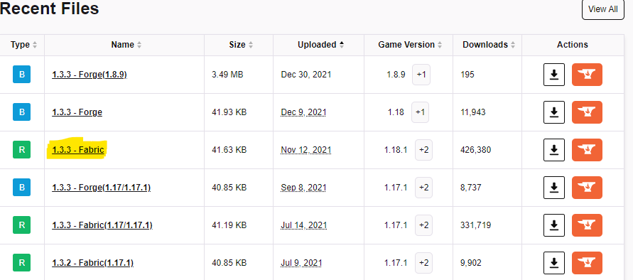
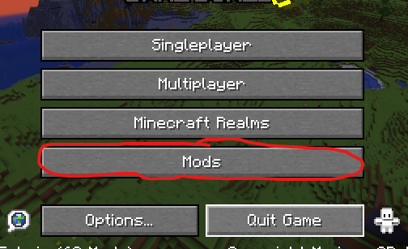
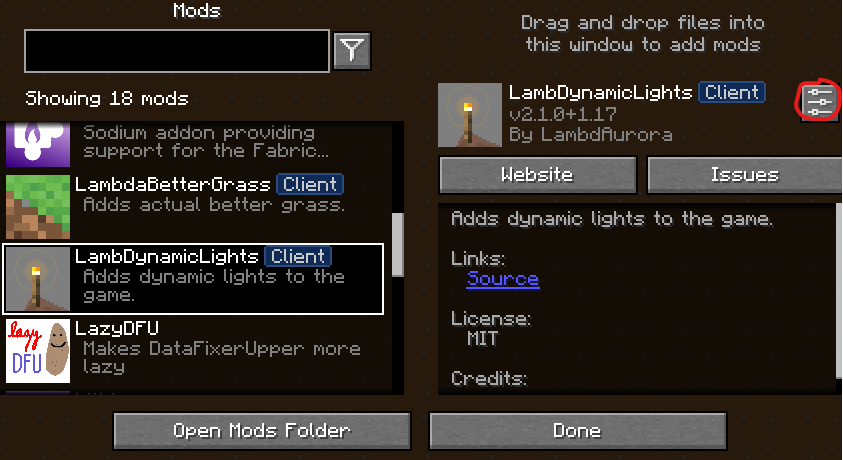
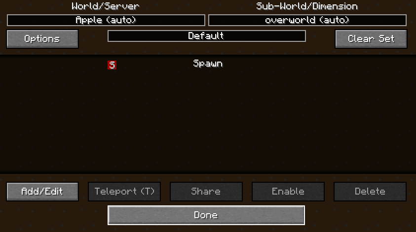
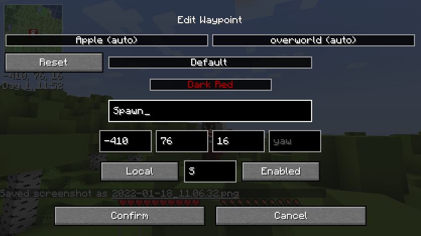
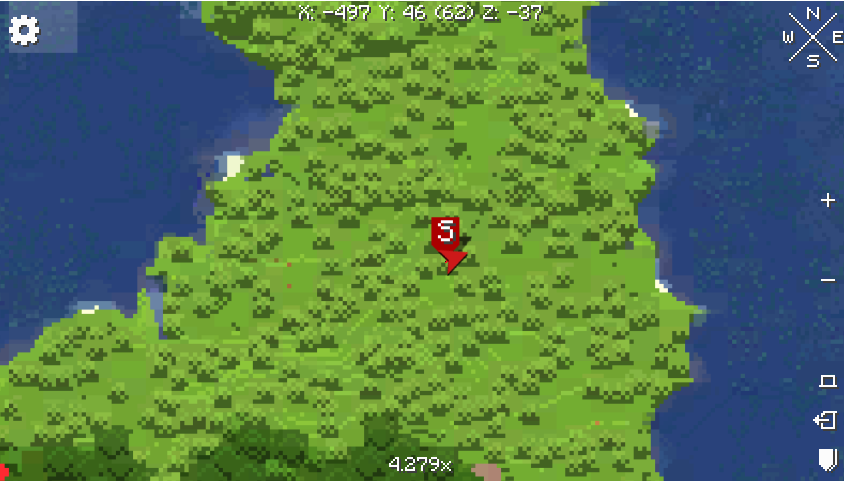

# Joining Instructions

## <ins>Introduction</ins>:
Hopefully this document will provide a comprehensive guide to getting set up.  Let me know if there is anything that is missing or requires further elaboration

## 1 - <ins>Minecraf</ins>t:
Install [Minecraft Java Edition](https://www.minecraft.net/en-us/store/minecraft-java-edition).

---
## 2 - <ins>Fabric Installer</ins>:
Download and run the `Fabric Installer`*

> ##### * Fabric is a "lightweight, experimental modding toolchain for Minecraft" - it automagically installs and manages mods for us.

The download will gve you something like:

    fabric-installer-0.10.2.exe


### <ins>Install it!</ins> 
Run the executable - the default configuration options should be correct.

---

## 4 - Mods Glorious Mods:
The following is a curated selection of mods which provide various performance and quality of life improvements.

They aren't _essential_ but some of them are dependent upon others so pick and mix at your own risk...😉

Some of the mods below will have two version options - `forge` and `fabric`.  We need to download the `fabric` version when an option is available <sup>[`1`]</sup>


| name | link | description |
|---|---|---|
|Fabric API|[link](https://www.curseforge.com/minecraft/mc-mods/fabric-api/files)|Required for Fabric mods to work!|
|Mod Menu|[link](https://www.curseforge.com/minecraft/mc-mods/modmenu/files)| Adds a new menu in-game for accessing mods and opening settings and such <sup>[`2`,`3`]|
|**Performance Boosters** |
|Sodium| [link](https://www.curseforge.com/minecraft/mc-mods/sodium/files) | graphical performance booster |
|Indium| [link](https://www.curseforge.com/minecraft/mc-mods/indium/files) | rendering optimisation mod built on Sodium | 
|Phosphor| [link](https://www.curseforge.com/minecraft/mc-mods/phosphor/files)| improved lighting performance |
|Lithium| [link](https://www.curseforge.com/minecraft/mc-mods/lithium/files) | general performance boosts |
|Entity Culling|[link](https://www.curseforge.com/minecraft/mc-mods/entityculling/files)|Improves performance by not rendering entities that can't be seen|
|Lazy Data Fixer-Upper|[link](https://www.curseforge.com/minecraft/mc-mods/lazydfu/files)|Makes the game start faster|
| **Graphical + Sound Improvements** |
|Animatica|[link](https://www.curseforge.com/minecraft/mc-mods/animatica/files)| adds support for animated textures |
|Custom Entity Models|[link](https://www.curseforge.com/minecraft/mc-mods/custom-entity-models-cem/files)| adds support for custom models |
|Continuity|[link](https://www.curseforge.com/minecraft/mc-mods/continuity/files)|adds support for connected textures|
|Dynamic Sound Filters|[link](https://www.curseforge.com/minecraft/mc-mods/dynamic-sound-filters/files)| adds context-sensitive effects to ingame sounds for greater *immersion*, e.g.: echos in caves|
|Lambda Better Grass|[link](https://www.curseforge.com/minecraft/mc-mods/lambdabettergrass/files)|Makes sides of blocks prettier|
|Lamb Dynamic Lights|[link](https://www.curseforge.com/minecraft/mc-mods/lambdynamiclights/files)|Better ambient lighting, e.g.: light sources in-hand emit light|
| **Maps** |
|Xaero's Minimap|[link](https://www.curseforge.com/minecraft/mc-mods/xaeros-minimap/files)|adds a minimap to the top corner, ability to create/share waypoints (press [`U`] to add/edit/enable/disable/delete etc), and other useful features <sup>[`5`,`6`]</sup>|
|Xaero's Worldmap|[link](https://www.curseforge.com/minecraft/mc-mods/xaeros-world-map/files)|adds an in-game world map (press [`M`] in game to see <sup>[`7`]</sup>)

### Adding them to the game
The default minecraft installation directory is

``` 
%APPDATA%\Roaming\.minecraft 
```

Typically the AppData folder is hidden, but you can open it directly by copying and pasting the above in a File Explorer window.

Create a new folder: `mods`

Copy all of the downloaded mods and paste them into this folder.

---

## Play the game

That's it.  After running the Fabric Installer a new profile will have been created in Minecraft using the resultant modded version.  All the mods will be visible under a new `Mods` menu in-game and many of them have settings that can be tweaked according to preference or to improve visuals / performance (though not usually both at the same time!).

## Images
| | |
| --- | --- |
|[`1`] | |
|[`2`] | |
|[`3`] | |
|[`4`] |
|[`5`] |
|[`6`] |
|[`7`] |
